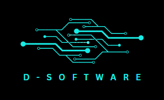
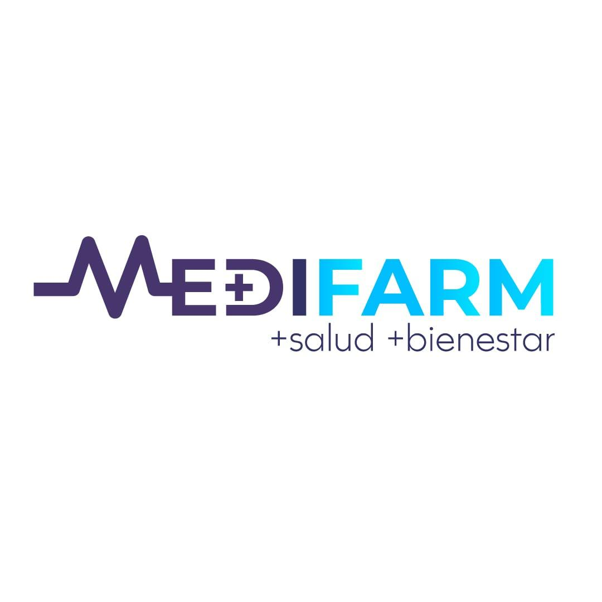

# 💊 Sistema de Gestión Integral FarmaClick

## Cliente: MediFarm

## 📖 Proyecto:
FarmaClick es un sistema web robusto de gestión interna y E-commerce diseñado por D-Software para el cliente farmacia MediFarm. El proyecto automatiza los procesos comerciales y logísticos, reemplazando la gestión manual para minimizar riesgos, mermas y errores humanos.

## 🛠️ Stack Tecnológico
* **Frontend:** React.js + Vite
* **Backend:** Node.js (22.17.1) + Express.js
* **Base de Datos:** PostgreSQL (alojado en Supabase Cloud / infraestructura DBaaS)
* **Despliegue:** GCP.

## ✨ Metodología de proyecto:
* **Agile Scrum**

## 👨‍💻 Scrum Team
**Product Owner / Developer - Alejandro Elias Fuentes Navarrete**  
**Scrum Master / Developer - Victor Rubilar**                     
**Developer - Robert Gonzalez** 

 
 
